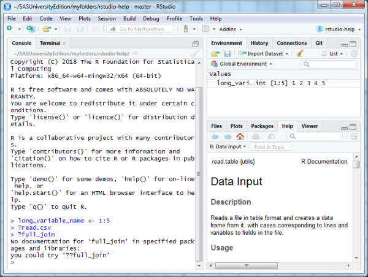
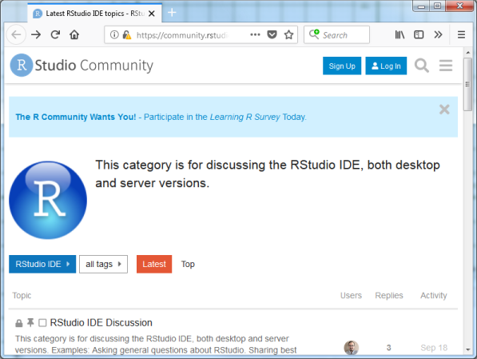

```{r setup, echo=FALSE}
suppressMessages(suppressWarnings(library(knitr)))
opts_chunk$set(echo = TRUE)
```

## Introduction

This talk will cover some of the help features built into RStudio.

## The autocomplete feature

 

<div class="notes">

RStudio has a nice autocomplete feature, which allows you to use long variable names without having to retype everything.

</div>

## Autocomplete feature for functions


<div class="notes">

When you use autocomplete on a function, popup window lists the possible autocomplete choices AND a brief listing of the variables in the function AND a brief explanation of what the file does.

</div>

## Help on functions within libraries



<div class="notes">

One nice feature in RStudio is searching for help for functions in libaries. If you are looking for help for the join function in dplyr, but you have not loaded dplyr yet with the library function, you will not get an answer.

</div>

## Help tab to the rescue!


<div class="notes">

But when you ask for help on the same function within the help tab, it provides help, provided you have installed the proper package.

</div>

## The help menu in RStudio


<div class="notes">

You have a lot of extra choices available to you in the help menu.

</div>

## Help menu: R Help


<div class="notes">

You can get links to a variety of web resources with the R Help submenu.

</div>

## Help menu: RStudio docs


## Help menu: RStudio Community Forum



<div class="notes">

I have not used the RStudio Community Forum.

</div>

## Help menu: RStudio support


<div class="notes">

I have also not used RStudio support. It appears to be a more technical forum that RStudio Community Forum.

</div>

## Help menu: Cheatsheets


<div class="notes">

Cheat sheets are one or two page PDF documents packed with summaries about various aspects of R and RStudio. I wrote one of these cheat sheets, "How Big is Your Graph".

</div>

## Help menu: Keyboard shortcuts


<div class="notes">

RStudio has a million different keyboard shortcuts. I only use a few of them, but you might find some of these helpful.

</div>

## Help menu: Markdown Quick Reference


<div class="notes">

The Markdown Quick Reference appears in your help tab. I refer to this a lot.

</div>

## Help menu: Roxygen Quick Reference


<div class="notes">

I have not used Roxygen, the R based system for documentation based on the Oxygen standard.

</div>

## Summary

RStudio offers a variety of help resources above and beyond what is available in R. These can be found in

* The autocomplete feature for function names,

* The Help tab

* The Help menu